# Coding Style for RTL Files
## Introduction
This is a short document describing the preferred coding style for all design and testbench RTL files. It is fair to say that coding style is very personal, and you may find code readable in one style but unreadable in another. Nevertheless, the intent of this document is to provide structure and uniformity, making the code portable across developers in the project. It also aims to minimize __linting__ and __synthesis__ warnings encountered during __ASIC tapeout__, which in turn helps ensure that the netlist generated during physical design is true to what was coded.

This document is partly inspired by the rules followed in the biggest and most important open source project in the world - __The Linux Kernel__.

---

## Table of Contents
- Ground Rules
- Directory Structure
- File Naming Conventions
- File Structure and Formatting
- Writing Readable Code
- Testbenches
- Dealing with Open Source IPs
- Conclusion

---

## Ground Rules
### 1. Preferred File Type -
For starters, we split RTL files into 2 sets:
1) Design Files
2) Testbench files

As of 2026, the preferred file type for design files by Cadence is __Verilog (.v)__. It is important to note that __SystemVerilog (.sv)__ files are also accepted and are the industry standard, but for the sake of reliability and Cadence tool maturity with Verilog files, it is better to use `.v` files for all design files.

Testbenches, however, are recommended to be coded in __SystemVerilog (.sv)__ format, as SystemVerilog has multiple inbuilt functional and formal testing features missing in Verilog. Some of the key functional and formal testing features in SystemVerilog that do not exist in Verilog include __SystemVerilog Assertions (SVA)__, __Constrained Random Verification (CRV)__, __Functional Coverage (covergroups)__, and __Object-Oriented Programming (OOP)__ for testbench creation.

Thus, to summarize:
 - Design Files - Verilog (.v)
 - Testbench - SystemVerilog (.sv)

### 2. Indentation -
By default, the __tab size__ in most editors and projects is set to __4__. While this seems reasonable in most cases, the tab size for all RTL files must be __8__.

__Rationale:__ The whole idea behind indentation is to clearly define where a block of control starts and ends. Especially when you've been looking at your screen for 20 straight hours, you'll find it a lot easier to see how the indentation works if you have large indentations.

Now, some people will claim that having 8-character indentations makes the code move too far to the right and makes it hard to read. The answer to that is that if you need more than 3 levels of indentation, you have likely structured your code poorly. While this may not show any problems in simulation, the generated netlist is highly unpredictable, sometimes containing multiple muxes and additional buffers that add to the total delay in the signal path.

In short, 8-character indents make things easier to read and have the added benefit of warning you when you are nesting your functions too deeply.

### *Steps to Change Tab Size*
#### 1) Vivado:

- Go to __Tools__ > __Settings__ > __Text Editor__ > __Tab and Indents__
- Set __Tab Size__ to __8__
- Click __Apply__ and __OK__.

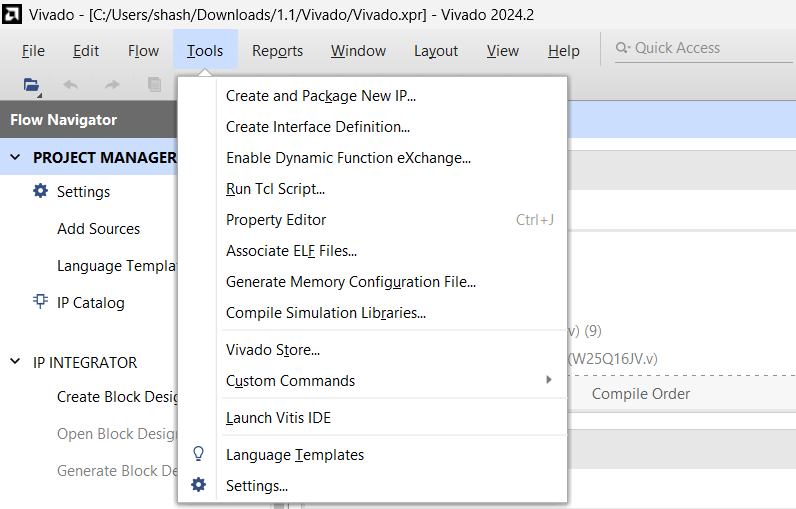
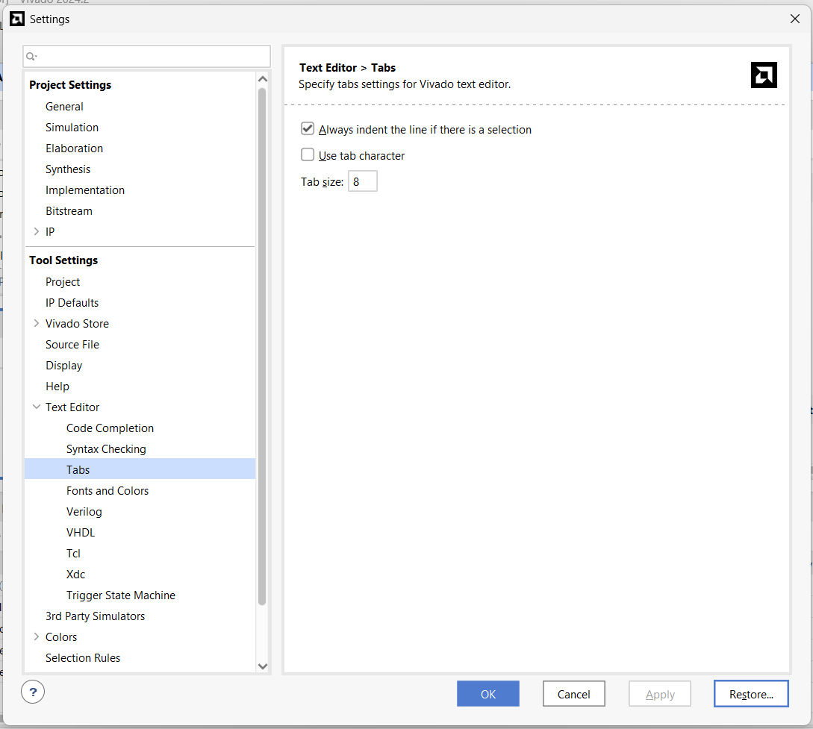

#### 2) Visual Studio Code:
- Open __Settings__ (File > Preferences > Settings)
- Search for __Tab Size__ in the search bar.
- Set __Tab Size__ to __8__.
- Ensure that __Insert Spaces__ is unchecked if you want to use actual tab characters instead of spaces.

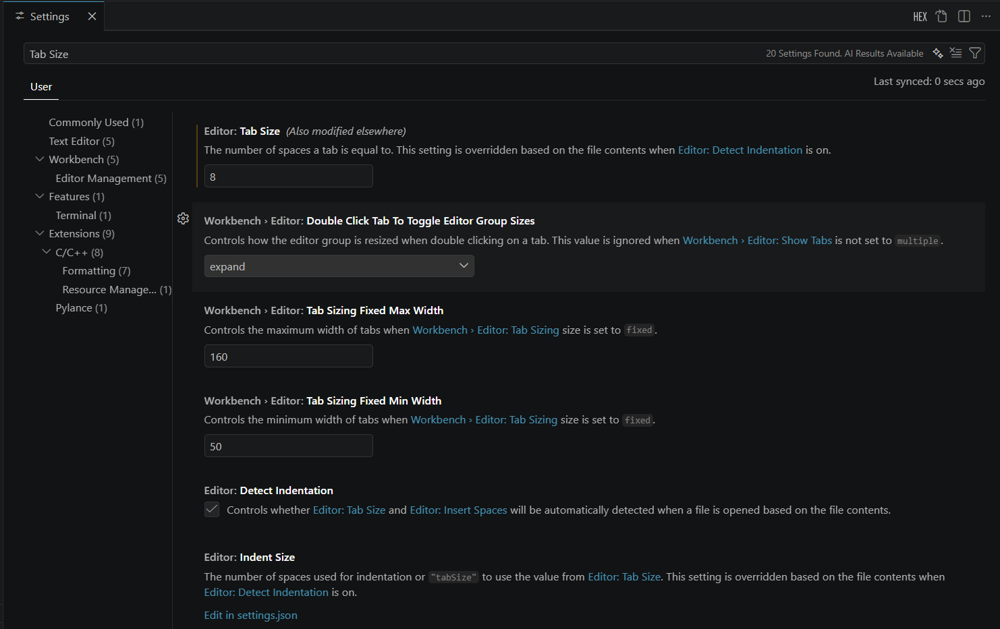
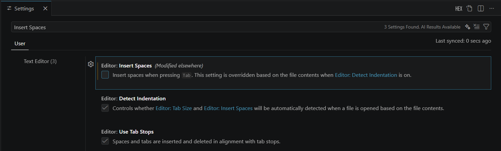

### 3. Trimming Whitespaces -

Trailing whitespace is a common source of linting warnings and can make code look untidy. It is recommended to trim trailing whitespace in all RTL files before committing to the repository. Most modern code editors provide an option to automatically trim trailing whitespace on save, which can be enabled to maintain clean code.

### *Steps to Enable Auto Trim Trailing Whitespaces*
#### 1) Vivado:

Vivado does not have a built-in feature to automatically trim trailing whitespaces.

#### 2) Visual Studio Code:
- Open __Settings__ (File > Preferences > Settings)
- Search for __Trim Trailing Whitespace__ in the search bar.
- Check the box for __Trim Trailing Whitespace__ to enable it.

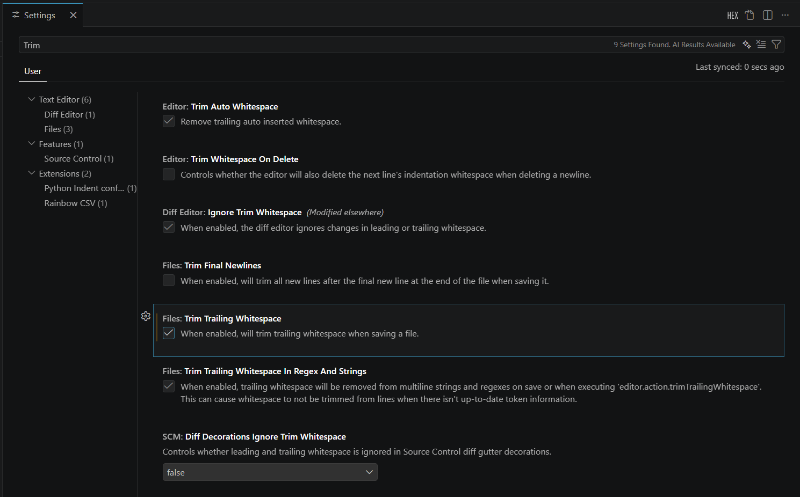

#### 3) Git Hook:
You can set up a Git pre-commit hook to automatically trim trailing whitespace before committing. Use one of the following based on your OS.

File type of `pre-commit`: Plain text shell script file with no extension (name must be exactly `pre-commit`).

Note: After `git init`, Git usually creates `.git/hooks/pre-commit.sample` with example checks. To enable your custom hook, use that sample file as a starting point and create `.git/hooks/pre-commit`.

##### *Windows (Git for Windows + Git Bash)*
Create `.git/hooks/pre-commit` (from `.git/hooks/pre-commit.sample`) and paste:

```bash
#!/bin/sh

# Trim trailing whitespace only in staged files, then re-stage them.
git diff --cached --check \
| sed -E 's/:[0-9]+:.*//' \
| sort -u \
| while IFS= read -r file; do
    [ -f "$file" ] || continue
    sed -i 's/[[:space:]]\+$//' "$file"
    git add -- "$file"
done

exit 0
```

Steps:
1) Open Git Bash in the repository root.
2) Run `mkdir -p .git/hooks`.
3) If `.git/hooks/pre-commit.sample` exists, run `cp .git/hooks/pre-commit.sample .git/hooks/pre-commit`; otherwise run `touch .git/hooks/pre-commit`.
4) Run `notepad .git/hooks/pre-commit`, remove all existing content, paste the script shown above, and save.
5) Run `chmod +x .git/hooks/pre-commit`.
6) In VS Code, set line endings to LF for `.git/hooks/pre-commit` and save.
    - LF means __Line Feed__ (`\n`), the Unix/Linux newline format used by shell scripts.
    - Do not use CRLF (`\r\n`) for Git hooks, or the script may fail with `/bin/sh^M` style errors.
    - In VS Code: open `.git/hooks/pre-commit` -> click `CRLF` or `LF` in the bottom-right status bar -> select `LF` -> save.
7) Optional checks in Git Bash:
    - Run `file .git/hooks/pre-commit` (should not show CRLF line terminators).
    - Run `ls -l .git/hooks/pre-commit` (should show executable permission bits, for example `-rwxr-xr-x`).
8) Test the hook:
    - Add trailing spaces in a tracked file.
    - Run `git add <file>`.
    - Run `git commit -m "test pre-commit hook"`.
    - Confirm trailing spaces were removed automatically.

##### *Linux*
Create `.git/hooks/pre-commit` and paste:

```bash
#!/bin/sh

# Trim trailing whitespace only in staged files, then re-stage them.
git diff --cached --check \
| sed -E 's/:[0-9]+:.*//' \
| sort -u \
| while IFS= read -r file; do
    [ -f "$file" ] || continue
    tmp="$(mktemp)"
    awk '{ sub(/[[:space:]]+$/, ""); print }' "$file" > "$tmp" &&
    mv "$tmp" "$file"
    git add -- "$file"
done

exit 0
```

Steps:
1) Open terminal in the repository root.
2) Run `mkdir -p .git/hooks`.
3) If `.git/hooks/pre-commit.sample` exists, run `cp .git/hooks/pre-commit.sample .git/hooks/pre-commit`; otherwise run `touch .git/hooks/pre-commit`.
4) Run `nano .git/hooks/pre-commit`, remove all existing content, paste the script shown above, and save.
5) Run `chmod +x .git/hooks/pre-commit`.
6) Optional check: run `ls -l .git/hooks/pre-commit` (should show executable permission bits).
7) Test the hook:
    - Add trailing spaces in a tracked file.
    - Run `git add <file>`.
    - Run `git commit -m "test pre-commit hook"`.
    - Confirm trailing spaces were removed automatically.

Every time you commit, the pre-commit hook will automatically trim trailing whitespace from all staged files, ensuring that your commits are clean and free of unnecessary whitespace.

Now that we have covered the ground rules, we will move on to the next section of this document - __Directory Structure__.

---

## Directory Structure
A well-organized directory structure is crucial for maintaining a clean and efficient codebase. It helps developers quickly locate files, understand the project layout, and promotes modularity.

You shouldn't have too many files in a single directory, as it can become overwhelming and difficult to navigate. Conversely, having too many nested directories can also make it hard to find files. A good rule of thumb is to aim for a balance, keeping related files together while avoiding excessive nesting.

For this project, we first separate the design files and testbench files into two main directories: `RTL/` and `tb/`.

To keep subfolders within `RTL/` simple, all files which are called by a wrapper module should be placed in the same folder as the wrapper module.

The folder is given same or similar name as the wrapper module.

Now, this folder (files + wrapper module) may be part of other wrapper modules with their own sets of files. Thus, this folder becomes a subfolder of the parent wrapper module's folder. This way, we can keep the directory structure simple and intuitive.

Here's an example of the directory structure:

```
project_root/
├── RTL/
│   ├── system.v
|   ├── <Respective .v files called directly by system.v>
|   ├── wrapper_module_1/
│       ├── wrapper_module_1.v // Calls wrapper_module_2 and wrapper_module_3
│       ├── file_a.v
│       ├── file_b.v
│       └── wrapper_module_2/
│           ├── wrapper_module_2.v
│           ├── file_c.v
│           └── file_d.v
|       └── wrapper_module_3/
│           ├── wrapper_module_3.v
│           ├── file_e.v
│           └── file_f.v
```

For the testbench, all files are kept in a single folder `tb/` as testbench files are not called by any wrapper module and are only used for testing purposes. This keeps the testbench directory simple and easy to navigate.

---

## File Naming Conventions
Consistent file naming conventions are essential for maintaining an organized codebase. They help developers quickly identify the purpose of a file and its relationship to other files in the project. Here are some guidelines for naming RTL files in this project:

1. __Use descriptive names__: File names should clearly indicate the purpose of the file. For example, if a file contains a module for an ALU, it could be named `alu.v`.
2. __Use lowercase letters and underscores__: To maintain consistency, use lowercase letters and underscores to separate words in file names. For example, `data_path.v` is preferred over `DataPath.v`.
3. __Avoid abbreviations__: While it may be tempting to use abbreviations to shorten file names, it can lead to confusion. Use full words to ensure clarity. For example, `control_unit.v` is preferred over `ctrl_unit.v`.
4. Wrapper modules should always use the suffix `_wrapper` or `_subsystem` in their name to clearly indicate their purpose. For example, `alu_wrapper.
v` for a wrapper module that instantiates the ALU.
5. The topmost wrapper need not have the suffix `_wrapper` or `_subsystem` as it is the top-level module and its purpose is clear from the context. For example, `system.v` for the top-level wrapper module that instantiates all other modules in the design.
6. __All testbench files__ should start with the prefix `tb_` to clearly indicate that they are testbench files. For example, `tb_alu.sv` for a testbench file that tests the ALU module.

### __NOTE:__
The module name inside the file should match the file name to maintain consistency and make it easier to identify the module associated with each file. For example, if the file is named `alu.v`, the module defined inside should be `module alu`.

---

## File Structure and Formatting
Uniformity in file structure helps maintain readability and makes it easier to debug and maintain the code.

Any (.v) design file should follow the following structure in this order:
- `timescale 1ns / 1ps`
- Comment Header
- `define` statements (if any)
- module declaration and I/O port list
- Parameter declarations (if any)
- `wire` and `reg` declarations
- Instantiations of submodules (if any)
- Sequential logic (always blocks)
- Combinational logic (always blocks)
- Continuous assignments (assign statements)
- endmodule

### *Comment Header*
Every file should start with a comment header that provides essential information about the file.

Here is a template for the comment header:

```verilog
`timescale 1ns / 1ps
///////////////////////////////////////////////////////////////////////////////////////////////////////////////////////////
// Engineer: <Replace with your full name>
// Last Modified: 29.03.2026
// Module Name: <Replace with module name>
// Project Name: Silicon SoC kNN
// Description:
//
///////////////////////////////////////////////////////////////////////////////////////////////////////////////////////////
```

whenever major logical changes are made to the file, the `Last Modified` field should be updated with the current date.

The `Description` field should provide a brief overview of the module's functionality and its role in the overall design.

This helps other developers quickly understand the purpose of the file and its functionality without having to read through the entire code. It also serves as a useful reference for future maintenance and debugging efforts.

### *Wrapper/Subsystem Modules*
As a general rule of thumb, wrapper/subsystem modules should be kept as clean and simple as possible, AVOID calling any logic in the wrapper module itself.

The wrapper module should ONLY instantiate the submodules and connect them together.

This is extremely helpful when viewing the design in __schematic view__ as it allows you to quickly understand the overall structure of the design and how the different modules are connected together.

It also makes it easier to debug and maintain the code, as any issues can be isolated to specific submodules without having to worry about the wrapper module itself.

Here is example of schematic view without clean wrapper modules:

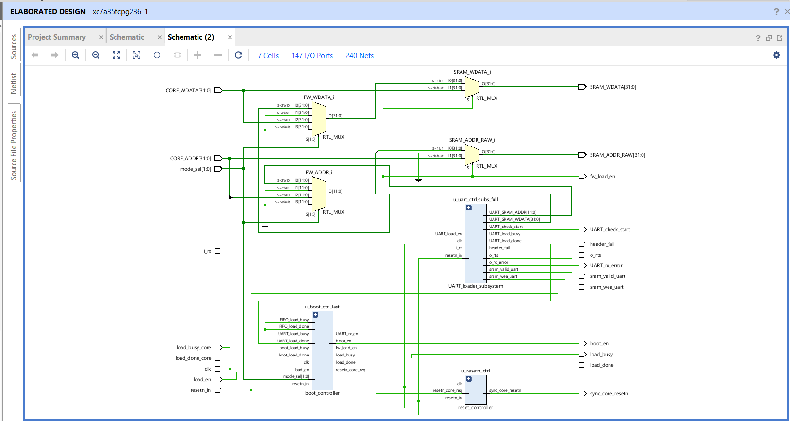

Compared to one with clean wrapper modules:

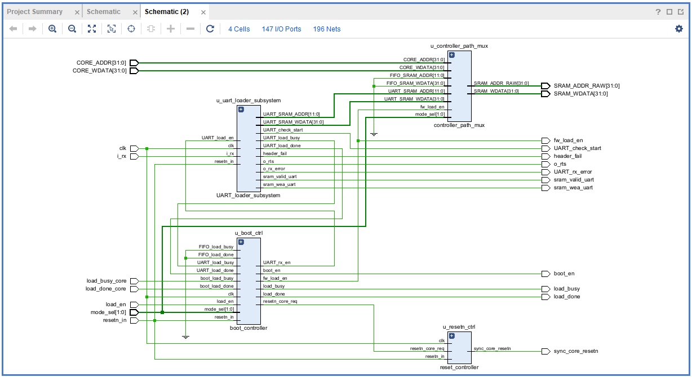

Now right now this may not seem like a big deal, but as the design grows in complexity, not using clean wrapper modules can lead to a very messy and difficult to understand schematic view:

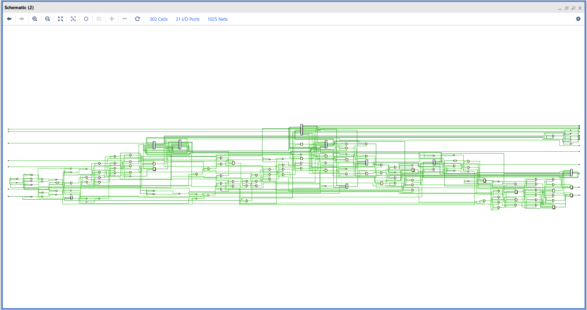

---

## Writing Readable Code
Now, with the ground rules, directory structure, file naming conventions, and file structure mentioned above very minimal changes are needed to be made to write readable code. However, here are some additional tips for writing readable code:

### 1. __Variable and signal names__:

Variable and signal names should be chosen so that the name itself gives an idea of what the variable/signal represents. For example, `counter` is a better name than `cnt` for a signal that counts something.

In the case of `for` loops, use standard variable names like `i`, `j`, and `k` for loop indices rather than `loop_counter`, but ensure that the loop's purpose is clear from the context.

#### NOTE:

If a signal is pulled from a lower-level module to a higher-level wrapper, it is recommended to keep the EXACT SAME name for the signal in the wrapper module as well. This helps maintain consistency and makes it easier to trace signals through the design when viewing the schematic.

An example of this is shown below for the signal `o_rx_error`:

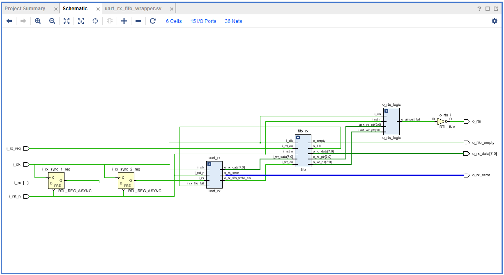

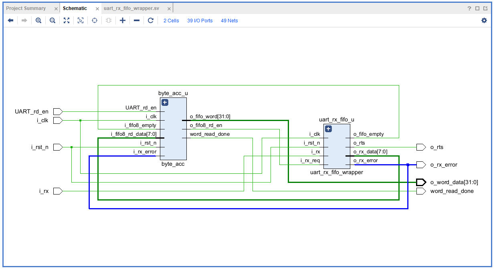

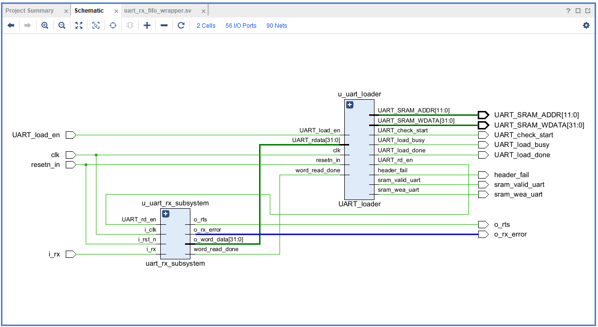

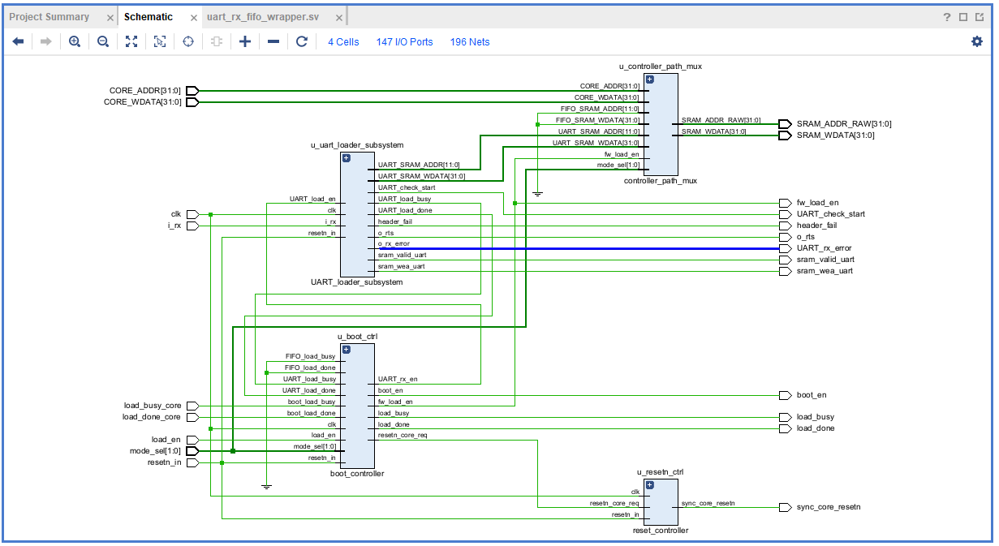

We see that only in the last image the signal name is changed from `o_rx_error` to `UART_rx_error`, as the final top module may also have a signal called `FIFO_rx_error` and changing the name to `UART_rx_error` helps us easily identify which signal comes from which module when viewing the schematic.

### 2. __Comments__:

Comments are good, but there is also a danger of over-commenting. NEVER try to explain HOW your code works in a comment: it's much better to write the code so that the working is obvious, and it's a waste of time to explain badly written code.

Generally, you want your comments to tell WHAT your code does, not HOW. Also, try to avoid putting comments inside a function body: if the function is so complex that you need to separately comment parts of it, you should break the logic down into simpler FSMs. You can make small comments to note or warn about something particularly clever (or ugly), but try to avoid excess. Instead, put the comments at the head of the function, telling people what it does, and possibly WHY it does it.

The preferred style for long (multi-line) comments is:

```verilog
/*
 * This is the preferred style for multi-line
 * comments in the Linux kernel source code.
 * Please use it consistently.
 *
 * Description:  A column of asterisks on the left side,
 * with beginning and ending almost-blank lines.
 */
 ```

This style of commenting is taken inspiration from the __Linux kernel source code__ and is visually distinct and helps to separate the comment block from the code, making it easier to read and understand. It also provides a clear structure for multi-line comments, which can be especially helpful for longer explanations or documentation within the code.

It is also preferred to have single-line comments mainly for *__Input__* and *__Output Ports__* in the module declaration, and for internal `wire` and `reg` declarations related to non-trivial logic in the code.

Again, an important thing to note is to provide these comments only when the signal name itself is not descriptive enough to explain the purpose of the signal.

For example, if we have a signal called `counter`, it is pretty obvious that it is a counter and we do not need to add a comment saying `// This is a counter`.

But for a signal such as `resetn_core_req`, it is not immediately obvious what this signal represents, and thus a comment such as `// Active low reset signal to release core` can be helpful to understand the purpose of the signal.

#### NOTE:

There is a simple quote by __Terry A. Davis__ (Creator of Temple OS) that everyone should keep in mind when writing comments and defining variables/signals -

*"An idiot admires complexity, a genius admires simplicity."*

- Keep the signal names simple and descriptive
- Keep the comments simple and to the point explaining the "what" and "why", NOT the "how".

Here is an example of all the above tips put together in a single code snippet:

```verilog
module boot_controller
(
	input		clk,
	input		load_en, resetn_in, //mapped to external switch
	input 		UART_load_done, FIFO_load_done, boot_load_done,
   	input [1:0] mode_sel, //mapped to external switch
   	input 		UART_load_busy,
   	input 		FIFO_load_busy,
   	input 		boot_load_busy,
   	output reg 	resetn_core_req, //Active low reset signal to release core
   	output reg 	boot_en, fw_load_en, UART_rx_en,FIFO_rx_en,
   	output reg 	load_busy,
   	output reg 	load_done
);


...


/*
 * State register and fw_load_done tracking.
 * Keeps a sticky "done" indication until a new load request arrives.
 */
always @ (posedge clk)
begin
	if(!resetn_in)
    begin
	    state <= IDLE;
		fw_load_done <=0;
    end
    else
    begin
        if (state == IDLE && load_en)
	        fw_load_done <= 1'b0;
		else
	        fw_load_done <= fw_load_done_next;
		state <= next_state;
    end
end
```

#### Comment titles:

When defining internal `wire` and `reg` for any non-trivial logic, it is preferred to group them together and give a comment title to the group of signals which are either part of the same logic or are used within the same module instance.

The same comment titles should also be used for submodule instantiations to clearly separate multiple submodule instantiations in the wrapper module.

An example of this is shown below:

```verilog
//-------------------------------------//
// parameter definition for FSM States //
//-------------------------------------//
parameter [2:0] IDLE = 3'b000,
		SAMPLE = 3'b001,
		FIFO_LOAD = 3'b010,
		UART_LOAD = 3'b011,
		RST_RELEASE = 3'b100;

//-------------------------------//
// Intermediate internal signals //
//-------------------------------//
reg fw_load_done;
wire fw_load_done_next;
reg load_done_latch;

//-----------------//
// state registers //
//-----------------//
reg [2:0] state, next_state;

//------------------------------------------------//
// Intermediate Signals for load busy/done status //
//------------------------------------------------//
wire busy_any;
wire done_any;


...


//----------------------------//
// boot_controller instance //
//----------------------------//
boot_controller u_boot_ctrl (
	.clk			(clk),
   	.resetn_in		(resetn_in),
   	.load_en		(load_en),
   	.mode_sel		(mode_sel),

   	// UART signals (stub when disabled)
   	.UART_load_done	(UART_ld_done),
   	.UART_load_busy	(UART_load_busy),
   	.UART_rx_en		(UART_rx_enable),

   	// FIFO signals (stub when disabled)
   	.FIFO_load_done (FIFO_ld_done),
   	.FIFO_load_busy (FIFO_load_busy),
   	.FIFO_rx_en		(FIFO_rx_en),

   	// Boot signals (stub when disabled)
   	.boot_load_done (load_done_core),
   	.boot_load_busy (load_busy_core),
   	.boot_en		(boot_en),

   	// Outputs
   	.resetn_core_req(resetn_core_req),
   	.fw_load_en		(fw_load_en),
   	.load_done		(load_done),
   	.load_busy		(load_busy)
);
```

This helps to visually separate different groups of signals and makes it easier to understand the purpose of each signal and how they are related to each other. It also improves readability and maintainability of the code, as developers can quickly identify which signals are part of the same logic or module instance.

Here is a template for the comment titles:

```verilog
//----------------------------------//
// <Replace with descriptive title> //
//----------------------------------//
```

### 3. __Dealing with long lines__:

Coding style is all about readability and maintainability using commonly available tools.

The preferred limit on the length of a single line is 80 columns.

Statements longer than 80 columns should be broken into sensible chunks, unless exceeding 80 columns significantly increases readability and does not hide information.

For long assign statements, the preferred style is:

```verilog
assign long_signal_name = signal_a & signal_b &
			  			  signal_c & signal_d &
			  			  signal_e & signal_f;
```

This style allows for clear separation of the different signals being ANDed together, making it easier to read and understand the logic.

### 4. __Brackets and Spaces__:

Brackets `()` are mainly encountered in module definitions and submodule instantiations in Verilog code.

For __Spaces__, in module keep all the signal names in the same indentation level and use spaces to align the port names and parameter names vertically for better readability.

In general, for module definitions, keep the braces on separate lines for both parameter list and port list, and align the port names and parameter names vertically for better readability. For example:

```verilog
module SRAM_controller
#(
	parameter 			N = 12,
	parameter 			W = 32
)(
	input 				clk,
	input 				resetn_in,
	input 				load_en,
	input 				i_rx,
	input [1:0] 		mode_sel,

   	//Signals from Core
   	input wire 			load_busy_core, // Active when flash -> core -> SRAM load is in progress
   	input wire 			load_done_core, // Active when flash -> core -> SRAM load is done
   	input wire [W-1:0] 	CORE_WDATA,
   	input wire [31:0] 	CORE_ADDR,

   	//Signals to Core
   	output wire 		sync_core_resetn, // Synchronous reset to core (active low)
   	output wire 		boot_en, // Active during firmware loading (flash -> core -> SRAM)

   	//Signals to address decoder
   	output wire [31:0] 	SRAM_ADDR_RAW, // Raw address to SRAM (before any address translation)
   	output wire 		fw_load_en,

   	//Signals to SRAM (after MUX selection)
   	output wire [31:0] 	SRAM_WDATA, // Final write data to SRAM

   	// Flags and status outputs
   	output 				load_busy,
   	output 				load_done,
   	output 				o_rts,
   	output 				UART_check_start,
   	output 				UART_rx_error,
   	output 				header_fail,

   	// BRAM IP Specific Interfacing Signals
   	output 				sram_valid_uart,
   	output 				sram_wea_uart
);
```

For submodule instantiations, however, the preferred style is to keep the opening bracket on the same line as the module name and align the port connections vertically for better readability.

```verilog
//-------------------------------//
// controller_path_mux instance  //
//-------------------------------//
controller_path_mux #(
	.N				(N),
	.W				(W)
) u_controller_path_mux (
	.mode_sel		(mode_sel),
	.fw_load_en		(fw_load_en),
	.CORE_WDATA		(CORE_WDATA),
	.CORE_ADDR		(CORE_ADDR),
	.UART_SRAM_WDATA(UART_SRAM_WDATA),
	.UART_SRAM_ADDR	(UART_SRAM_ADDR),
	.FIFO_SRAM_WDATA(FIFO_SRAM_WDATA),
	.FIFO_SRAM_ADDR	(FIFO_SRAM_ADDR),
	.FW_ADDR		(FW_ADDR),
	.FW_WDATA		(FW_WDATA),
	.SRAM_ADDR_RAW	(SRAM_ADDR_RAW),
	.SRAM_WDATA		(SRAM_WDATA)
);
```

#### NOTE:
> When calling the submodule use `u_` as prefix for the instance name to clearly indicate that it is a module instance. For example, `u_controller_path_mux` for an instance of the `controller_path_mux` module. This is a common convention in Verilog coding style and helps to easily identify module instances in the code.

### 5. __`begin` and `end` placement for `if-else` and `case` statements__:

There are different ways people prefer to place `begin` and `end` statements for `if-else` and `case` statements.

Some prefer to place the `begin` statement on the same line as the `if` or `else` keyword.

For starters, any `if-else` or `case` statement with ONLY ONE statement in its body should NOT have `begin` and `end` statements, as this is redundant and adds unnecessary lines to the code (although it may be slightly more readable).

```verilog
if (condition)
    statement;
else
    statement;
```
For `if-else` and `case` statements with MORE THAN ONE statement in the body, it is preferred to have `begin` and `end` at the same indentation level.

This easily helps to visually separate the different blocks of code and makes it easier to understand the structure of the code.

```verilog
/*
 * State register and fw_load_done tracking.
 * Keeps a sticky "done" indication until a new load request arrives.
 */
always @ (posedge clk)
begin
	if(!resetn_in)
    begin
	    state <= IDLE;
		fw_load_done <=0;
    end
    else
    begin
        if (state == IDLE && load_en)
	        fw_load_done <= 1'b0;
		else
	        fw_load_done <= fw_load_done_next;
		state <= next_state;
    end
end
```

Here is an example with case statement:

```verilog
always @ (posedge clk)
begin
	if(!resetn_in)
    begin
		resetn_core_req <= 0;
		fw_load_en <= 0;
		boot_en <= 0;
		UART_rx_en <= 0;
		FIFO_rx_en <= 0;
    end
    else
    begin
		case(state)
	    		IDLE:
                begin
				    resetn_core_req <= 0;
				    if(load_en & !fw_load_done)
		    			fw_load_en <= 1;
	    		end
	    		SAMPLE:
                begin
				    if(mode_sel == 2'b00)
		    		    boot_en <= 1;
				    else
		    			boot_en <=0;
	    		end
	    		FIFO_LOAD:
                begin
				    FIFO_rx_en <= 1;
				    if(fw_load_done_next)
		    			fw_load_en <= 0;
	    		end
	    		UART_LOAD:
                begin
				    UART_rx_en <= 1;
				    if(fw_load_done_next)
		    			fw_load_en <= 0;
	    		end
	    		RST_RELEASE:
                begin
				    resetn_core_req <= 1;
				    if (fw_load_done)
                    begin
		    			boot_en <= 0;
		    			FIFO_rx_en <= 0;
		    			UART_rx_en <= 0;
				    end
	    		end
	    		default:
                begin
				    resetn_core_req <= 0;
				    fw_load_en <= 0;
				    boot_en <= 0;
				    UART_rx_en <= 0;
				    FIFO_rx_en <= 0;
			    end
		endcase
    end
end
```

### 6. __Avoid assigning logic directly to wire when defining them__:

It is preferred to avoid assigning logic directly to `wire` when defining them.

As in a project if a few signals are assigned value using assign statements and a few signals are assigned value directly in the `wire` definition, you have to continuosly scroll up and down to check which signals are defined using assign statements and which are defined using direct assignment in the `wire` definition, which can be a bit annoying and can also lead to missing some signals.

Avoid:
```verilog
wire signal_a = signal_b & signal_c;
```
Preferred:
```verilog
wire signal_a;


...


assign signal_a = signal_b & signal_c;
```

This concludes the Writing Readable Code section.

---

## Testbenches

Testbenches, in general, do not have coding style rules as strict as design files, as most developers writing testbenches focus on functionality and breaking the design through corner cases rather than readability and maintainability.

Thus, following the ground rules, directory structure, and file naming conventions mentioned above is sufficient for writing testbenches.

The only additional tip for testbenches is to use the comment header to provide a detailed description of all test cases being performed and verified, in order. This helps other developers quickly understand the purpose of the testbench and the different scenarios being tested without having to read through the entire code.

Here is an example of a testbench comment header with detailed description of the test cases taken from the testbench `tb_SRAM_Controller_full.sv`:

```verilog
`timescale 1ns / 1ps
///////////////////////////////////////////////////////////////////////////////////////////////////
// Engineer: Shashank Tiwari, Samyak Nidhi
// Update Date: 27.03.2026
// Module Name: tb_SRAM_Controller_full
// Project Name: Silicon SoC kNN
// Description:
// Testbench for verifying addr_decoder integration within SRAM_controller.
// Test order:
// (1) Master reset w/ decoder disabled → confirm `fw_load_en`, `boot_en`, `load_busy`
//     remain low and `decoded_SRAM_ADDR` floats for CORE_ADDR = 0x000/0x900.
// (2) UART load smoke → enable mode_sel=2'b10, assert load_en, wait for fw_load_en,
//     transmit CTS/RTS header 0xA5D5 + 10 data words while CORE side is stuck at
//     CORE_ADDR=0x999 / CORE_WDATA=0x9999_9999. After each word ensure SRAM_WDATA
//     differs from core data, then wait for load_done and drop load_en.
// (3) UART bad header check → re-run load, issue malformed header, expect header_fail to latch.
// (4) Post-UART idle check → after fw_load_en drops, re-run loader inactivity task to
//     verify all loader/control outputs return low.
// (5) Core write sweep → set core_decoder_en=1 and march CORE_ADDR from 0x800 upward
//     (10 entries spaced by 4). For each address, expect SRAM_WDATA to mirror CORE_WDATA
//     and decoded address to equal CORE_ADDR[N+1:2], holding each stimulus for 5,000 cycles.
// (6) Summary + watchdog → print pass/fail totals; an independent 500 ms watchdog ensures
//     the bench terminates if anything stalls.
// Throughout: scoreboard counters plus SV assertions monitor loader gating, path ownership,
// address translation, and reset behavior continuously.
///////////////////////////////////////////////////////////////////////////////////////////////////
```

### UUT in Testbench

When instantiating the Unit Under Test (UUT) in the testbench, follow the same principle done for module. Keep the indentation of signal connections at the same level and align the port connections vertically for better readability.

```verilog
SRAM_controller #(
	.N				  (N),
	.W 				  (W)
	) dut (
	.clk              (clk),
	.resetn_in        (resetn_in),
	.load_en          (load_en),
	.i_rx             (i_rx),
	.mode_sel         (mode_sel),
	.load_busy_core   (load_busy_core),
	.load_done_core   (load_done_core),
	.CORE_WDATA       (CORE_WDATA),
	.CORE_ADDR        (CORE_ADDR),
	.sync_core_resetn (sync_core_resetn),
	.boot_en          (boot_en),
	.SRAM_ADDR_RAW    (SRAM_ADDR_RAW),
	.fw_load_en       (fw_load_en),
	.SRAM_WDATA       (SRAM_WDATA),
	.load_busy        (load_busy),
	.load_done        (load_done),
	.o_rts            (o_rts),
	.UART_check_start (UART_check_start),
	.UART_rx_error    (UART_rx_error),
	.header_fail      (header_fail),
	.sram_valid_uart  (sram_valid_uart),
	.sram_wea_uart    (sram_wea_uart)
	);

addr_decoder #(
	.N					  (N)
	) u_addr_decoder (
	.fw_load_en           (fw_load_en),
	.core_decoder_en      (core_decoder_en),
	.core_decoder_en_remap(core_decoder_en_remap),
	.mode_sel             (mode_sel),
	.SRAM_ADDR_RAW        (SRAM_ADDR_RAW),
	.SRAM_ADDR            (decoded_SRAM_ADDR)
	);
```

Use the same template as mentioned in the comment header above or copy the one given below:

```verilog
`timescale 1ns / 1ps
///////////////////////////////////////////////////////////////////////////////////////////////////////////////////////////
// Engineer: <Replace with your full name>
// Last Modified: 29.03.2026
// Module Name: tb_<Replace with module name being tested>
// Project Name: Silicon SoC kNN
// Description:
//
///////////////////////////////////////////////////////////////////////////////////////////////////////////////////////////
```

---

## Dealing with Open Source IPs

As common practice in HDL design, we often use open source IPs for various components in our design rather than reinventing the wheel and coding everything from scratch. This is a good practice, as it saves time and effort and also allows us to leverage the expertise of the open source community.

When using open source IPs, it is safer to leave the IPs untouched and not modify any aspect of the IP code.

This is because the IP code is usually well tested and verified by the open source community, and any modifications made to the code can introduce bugs and issues that may be difficult to debug and fix.

To ensure other developers know that the files are open source IPs and should not be modified, add a comment header at the top of the file indicating that it is an open source IP and should not be modified.

Here is a template for the comment header for open source IPs:

```verilog
////////////////////////////OPEN SOURCE MODULE////////////////////////////////////

//////////////////////////////////////////////////////////////////////////////////
// Engineer: <Replace with original author name if available, otherwise your full name>
// Update Date: 29.03.2026
// Module Name: <Replace with module name>
// Project Name: Silicon SoC KNN
// Description:
//
//////////////////////////////////////////////////////////////////////////////////
```

Provide a detailed description of the module and its functionality in the `Description` field of the comment header to help other developers quickly understand the purpose of the module without having to read through the entire code.

---

## Conclusion

Many of the points mentioned here may seem against the grain of how you would like to write code.

Understanding this, the coding style mentioned here is open to suggestions and improvements.

The main goal of this document is to maintain a consistent coding style across the codebase to improve readability and maintainability, and if there are any suggestions that can help achieve this goal better (with valid reasons), they are more than welcome.

References:
1. Linux Kernel Coding Style: https://github.com/torvalds/linux/blob/master/Documentation/process/coding-style.rst